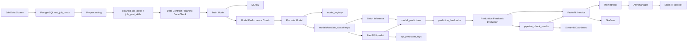

# jobskill-mlops project

[](https://github.com/hyunwoo4073/mlops_project/actions/workflows/pytest.yml)
[](https://github.com/hyunwoo4073/mlops_project/actions/workflows/smoke.yml)

채용공고 데이터를 기반으로 직무 분류 모델을 학습하고, Airflow, MLflow, FastAPI, Streamlit, Prometheus, Alertmanager, Grafana를 연결한 end-to-end MLOps 파이프라인 프로젝트입니다.

이 프로젝트는 단순 모델 학습 예제가 아니라, 데이터 수집부터 모델 학습, 모델 승격, API serving, 운영 예측 저장, production feedback 평가, metric 노출, alert, runbook, smoke check, CI 검증까지 포함한 경량 운영형 MLOps 시스템을 목표로 합니다.

## 문서 구성

```text
README.md
- GitHub main에서 바로 보는 프로젝트 소개 문서입니다.

docs/README_FULL.md
- 전체 구현 상세, 주요 업데이트 내역, 컴포넌트 설명, 운영 검증 흐름을 담은 상세 문서입니다.

docs/README_SUMMARY.md
- 프로젝트 핵심 기능과 운영 구조를 빠르게 파악하기 위한 요약본입니다.

docs/QUICKSTART.md
- 로컬에서 실행, 검증, API 호출, 모니터링 확인까지 따라 하는 실행 가이드입니다.
```

## 핵심 기능

```text
Data Pipeline
- sample / crawler / mixed 데이터 소스 모드
- Remote OK crawler retry / fallback
- PostgreSQL raw / cleaned / skill 테이블 적재
- data contract validation
- training data quality check

ML Pipeline
- TF-IDF + Logistic Regression baseline model
- MLflow experiment tracking
- training dataset profile / dataset hash 기록
- classification report / confusion matrix artifact 저장
- class-level performance gate
- best model promotion
- promoted model archive / rollback
- model card 생성

Serving / Feedback
- FastAPI /predict
- API prediction log 저장
- model_predictions lineage 저장
- prediction quality / drift check
- prediction_feedbacks 기반 production feedback 저장
- production feedback accuracy / weighted F1 평가
- production feedback metric / alert / runbook 연결

Monitoring / Alerting
- FastAPI /health /ready /metrics
- Prometheus scrape / alert rule
- Alertmanager webhook / Slack notification
- alert_events / alert_current_states 저장
- alert acknowledgement / MTTA / MTTR metric
- alert maintenance mode / silence / incident drill
- Grafana dashboard
- Streamlit dashboard

Validation / CI
- smoke check
- alert workflow check
- runbook coverage check
- metrics contract check
- alert rule metric dependency check
- compose rendered config check
- Prometheus rule unit test
- static ops validation
- GitHub Actions Python CI / Smoke Check
```

## Architecture


```mermaid
flowchart LR
    A[Job Data Source] --> B[PostgreSQL raw_job_posts]
    B --> C[Preprocessing]
    C --> D[cleaned_job_posts / job_post_skills]
    D --> E[Data Contract / Training Data Check]
    E --> F[Train Model]
    F --> G[MLflow]
    F --> H[Model Performance Check]
    H --> I[Promote Model]
    I --> J[model_registry]
    I --> K[models/best/job_classifier.pkl]
    K --> L[Batch Inference]
    K --> M[FastAPI /predict]
    L --> N[model_predictions]
    M --> N
    M --> O[api_prediction_logs]
    N --> P[prediction_feedbacks]
    P --> Q[Production Feedback Evaluation]
    Q --> R[pipeline_check_results]
    Q --> S[FastAPI /metrics]
    R --> S
    S --> T[Prometheus]
    T --> U[Alertmanager]
    U --> V[Slack / Runbook]
    S --> W[Grafana]
    R --> X[Streamlit Dashboard]
```

## 빠른 실행

```bash
cp .env.example .env
mkdir -p .secrets
cp .secrets.example/slack_webhook_url.example .secrets/slack_webhook_url

docker compose build airflow-image api
docker compose up -d postgres
make create-tables
make airflow-init
make up
```

샘플 파이프라인 실행:

```bash
make dag-trigger
```

API 샘플 요청:

```bash
make api-sample
```

Production Feedback 평가:

```bash
make production-feedback-sample
make production-feedback-check
```

운영 검증:

```bash
make smoke
make ops-static-check
make prometheus-rule-test
make runbook-check
make metrics-contract-check
make alert-rule-metric-check
```

## 접속 정보

```text
Airflow     : http://localhost:8080
MLflow      : http://localhost:5000
FastAPI     : http://localhost:8000
Dashboard   : http://localhost:8501
Prometheus  : http://localhost:9090
Alertmanager: http://localhost:9093
Grafana     : http://localhost:3000
```

## 오늘 반영된 주요 개선

```text
2026-07-28
- Production Feedback Evaluation Loop 추가
- prediction_feedbacks 기반 운영 정답/수정 라벨 저장
- check_production_feedback.py 기반 production accuracy / weighted F1 평가
- /metrics에 jobskill_production_feedback_* metric 노출
- Production feedback smoke check 추가
- JobSkillProductionFeedbackLowAccuracy / LowF1 alert 추가
- 한국어 production feedback runbook 추가
- Makefile 정리 및 production-feedback-sample / production-feedback-check 추가
- Prometheus rule test / runbook coverage / alert metric dependency 검증 완료
```

## 자세한 문서

```text
docs/README_FULL.md
docs/README_SUMMARY.md
docs/QUICKSTART.md
docs/runbooks/
```
